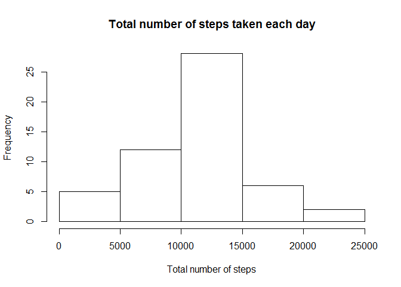
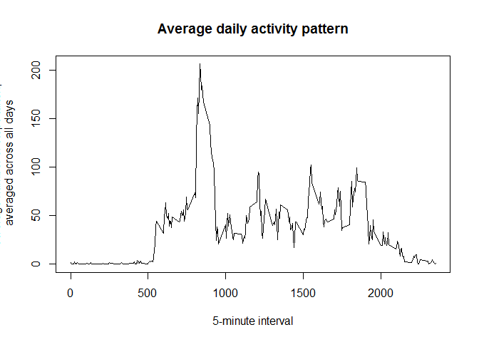
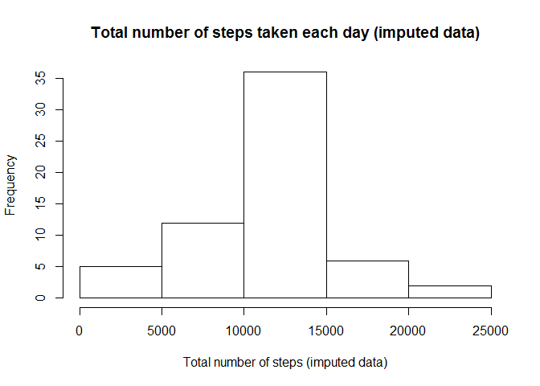
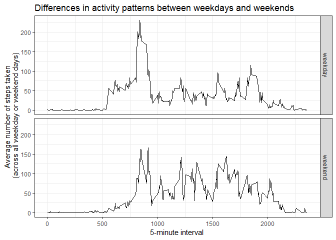

## Introduction

It is now possible to collect a large amount of data about personal
movement using activity monitoring devices such as a
[Fitbit](http://www.fitbit.com), [Nike
Fuelband](http://www.nike.com/us/en_us/c/nikeplus-fuelband), or
[Jawbone Up](https://jawbone.com/up). These type of devices are part of
the "quantified self" movement -- a group of enthusiasts who take
measurements about themselves regularly to improve their health, to
find patterns in their behavior, or because they are tech geeks. But
these data remain under-utilized both because the raw data are hard to
obtain and there is a lack of statistical methods and software for
processing and interpreting the data.

This assignment makes use of data from a personal activity monitoring
device. This device collects data at 5 minute intervals through out the
day. The data consists of two months of data from an anonymous
individual collected during the months of October and November, 2012
and include the number of steps taken in 5 minute intervals each day.

## Data

The data for this assignment can be downloaded from the course web
site:

* Dataset: [Activity monitoring data](https://d396qusza40orc.cloudfront.net/repdata%2Fdata%2Factivity.zip) [52K]

The variables included in this dataset are:

* **steps**: Number of steps taking in a 5-minute interval (missing
    values are coded as `NA`)

* **date**: The date on which the measurement was taken in YYYY-MM-DD
    format

* **interval**: Identifier for the 5-minute interval in which
    measurement was taken


The dataset is stored in a comma-separated-value (CSV) file and there
are a total of 17,568 observations in this
dataset.


## Assignment

This assignment will be described in multiple parts. You will need to
write a report that answers the questions detailed below. Ultimately,
you will need to complete the entire assignment in a **single R
markdown** document that can be processed by **knitr** and be
transformed into an HTML file.

Throughout your report make sure you always include the code that you
used to generate the output you present. When writing code chunks in
the R markdown document, always use `echo = TRUE` so that someone else
will be able to read the code. **This assignment will be evaluated via
peer assessment so it is essential that your peer evaluators be able
to review the code for your analysis**.

For the plotting aspects of this assignment, feel free to use any
plotting system in R (i.e., base, lattice, ggplot2)

Fork/clone the [GitHub repository created for this
assignment](http://github.com/rdpeng/RepData_PeerAssessment1). You
will submit this assignment by pushing your completed files into your
forked repository on GitHub. The assignment submission will consist of
the URL to your GitHub repository and the SHA-1 commit ID for your
repository state.

NOTE: The GitHub repository also contains the dataset for the
assignment so you do not have to download the data separately.


### Loading and preprocessing the data

Show any code that is needed to

1. Load the data (i.e. `read.csv()`)

```r
library(data.table)
filepath_activity_data <- "../activity.csv"
activity_data <- fread(filepath_activity_data)
```

2. Process/transform the data (if necessary) into a format suitable for your analysis


### What is mean total number of steps taken per day?

For this part of the assignment, you can ignore the missing values in
the dataset.

1. Make a histogram of the total number of steps taken each day

```r
activity_data_total_steps <- copy(activity_data[!is.na(steps), list(total_steps = sum(steps)), by = date])
with(
  activity_data_total_steps,
  hist(total_steps,
    xlab = "Total number of steps",
    main = "Total number of steps taken each day"
  )
)
```

<!-- -->

2. Calculate and report the **mean** and **median** total number of steps taken per day

```r
print(paste0(
  "Mean total steps by day: ",
  mean(activity_data_total_steps$total_steps)))
```

```
## [1] "Mean total steps by day: 10766.1886792453"
```

```r
print(paste0(
  "Median total steps by day: ",
  median(activity_data_total_steps$total_steps)
  ))
```

```
## [1] "Median total steps by day: 10765"
```

### What is the average daily activity pattern?

1. Make a time series plot (i.e. `type = "l"`) of the 5-minute interval (x-axis) and the average number of steps taken, averaged across all days (y-axis)

```r
activity_data_mean_interval <- copy(activity_data[!is.na(steps), list(avg_steps = mean(steps)), by = interval])
with(activity_data_mean_interval,
  plot(
    x = interval,
    y = avg_steps,
    type = "l",
    main = "Average daily activity pattern", xlab = "5-minute interval",
    ylab = "Average number of steps taken,\n averaged across all days"
  )
)
```

<!-- -->

2. Which 5-minute interval, on average across all the days in the dataset, contains the maximum number of steps?

```r
max_avg_steps_row <- which.max(activity_data_mean_interval$avg_steps)
activity_data_mean_interval[max_avg_steps_row, ]
```

```
##    interval avg_steps
## 1:      835  206.1698
```

### Imputing missing values

Note that there are a number of days/intervals where there are missing
values (coded as `NA`). The presence of missing days may introduce
bias into some calculations or summaries of the data.

1. Calculate and report the total number of missing values in the dataset (i.e. the total number of rows with `NA`s)

Total number of missing values in the dataset: 

```r
sum(is.na(activity_data))
```

```
## [1] 2304
```

2. Devise a strategy for filling in all of the missing values in the dataset. The strategy does not need to be sophisticated. For example, you could use the mean/median for that day, or the mean for that 5-minute interval, etc.

```r
impute_data <- function(interval){
  new_steps <- activity_data_mean_interval[interval == interval, ]$avg_steps
  return(new_steps)
}
```

3. Create a new dataset that is equal to the original dataset but with the missing data filled in.

```r
filled_activity_data <- copy(activity_data)
filled_activity_data[, steps := as.numeric(steps),]
filled_activity_data[is.na(steps), steps := impute_data(interval),]
```

4. Make a histogram of the total number of steps taken each day and Calculate and report the **mean** and **median** total number of steps taken per day. Do these values differ from the estimates from the first part of the assignment? What is the impact of imputing missing data on the estimates of the total daily number of steps?

```r
filled_activity_data_total_steps <- copy(filled_activity_data[, list(total_steps = sum(steps)), by = date])
with(
  filled_activity_data_total_steps,
  hist(total_steps,
    xlab = "Total number of steps (imputed data)",
    main = "Total number of steps taken each day (imputed data)"
  )
)
```

<!-- -->

Mean total steps by day (imputed data):

```r
mean(filled_activity_data_total_steps$total_steps)
```

```
## [1] 10766.19
```

Median total steps by day (imputed data):

```r
median(filled_activity_data_total_steps$total_steps)
```

```
## [1] 10766.19
```

Quantile differences:

```r
quantile(activity_data_total_steps$total_steps) - quantile(filled_activity_data_total_steps$total_steps)
```

```
##          0%         25%         50%         75%        100% 
##    0.000000 -978.000000   -1.188679  483.000000    0.000000
```

"Mean difference:

```r
mean(activity_data_total_steps$total_steps) - mean(filled_activity_data_total_steps$total_steps)
```

```
## [1] 0
```
There is obviously a change in the distribution, but that has no effect on the mean and a small change in the median. It seems that the imputed values have been quite evenly distrbuted over the two sides of the mean.

### Are there differences in activity patterns between weekdays and weekends?

For this part the `weekdays()` function may be of some help here. Use the dataset with the filled-in missing values for this part.

1. Create a new factor variable in the dataset with two levels -- "weekday" and "weekend" indicating whether a given date is a weekday or weekend day.

```r
filled_activity_data[,day_type := ifelse(
  weekdays(as.Date(date)) %in% c("sábado", "domingo"),
  "weekend",
  "weekday")]

filled_activity_data[,day_type := as.factor(day_type)]
```

2. Make a panel plot containing a time series plot (i.e. `type = "l"`) of the 5-minute interval (x-axis) and the average number of steps taken, averaged across all weekday days or weekend days (y-axis). See the README file in the GitHub repository to see an example of what this plot should look like using simulated data.


```r
filled_activity_data_mean_interval_day_type <- copy(filled_activity_data[, list(avg_steps = mean(steps)),
                                                                         by = list(interval, day_type)])
library(ggplot2)
```

```
## Warning: package 'ggplot2' was built under R version 3.5.1
```

```r
ggplot(data = filled_activity_data_mean_interval_day_type,
       mapping = aes(x = interval, y = avg_steps)) +
  geom_line() +
  facet_grid(facets = day_type ~ .) + 
  theme_bw() +
  labs(title = "Differences in activity patterns between weekdays and weekends",
       x = "5-minute interval",
       y = "Average number of steps taken\n (across all weekday or weekend days)")
```

<!-- -->


